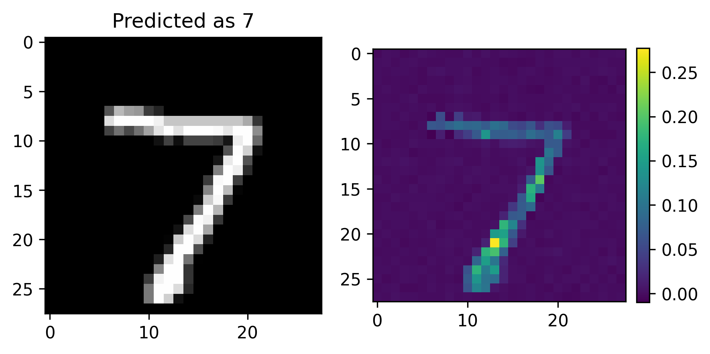
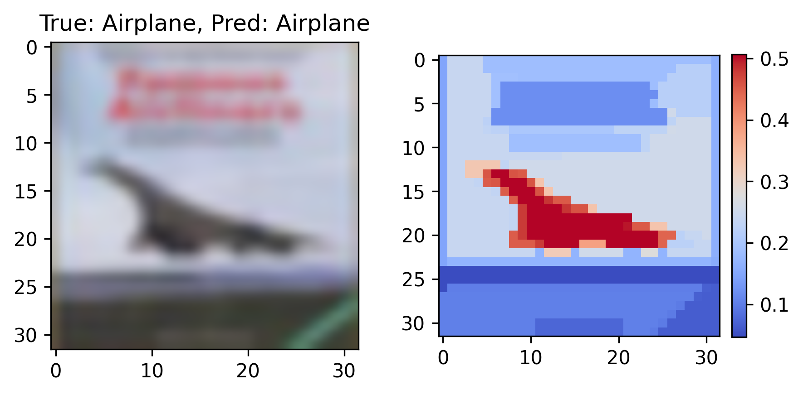
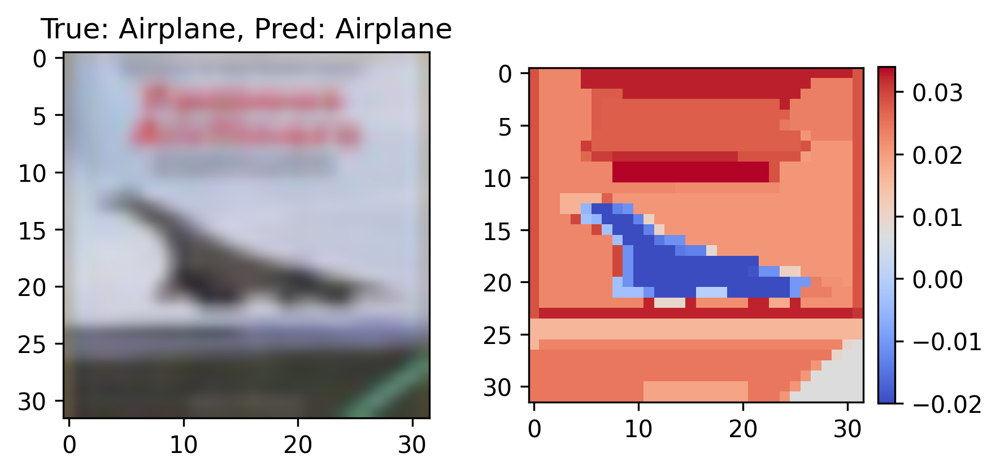

# SHAP for MNIST and CIFAR-10

## Information
@ date : Modified on Nov 26, 2020  
@ author : Sangjun Han, South Korea

## Method
This repository contains approximated SHAP referred as [2], sampling Shapely value according to its sampling probability.
The probability of sampling feature subset is extremely unbalanced expecially for high-dimensional data such as MNIST or CIFAR-10,
so I picked only nC0, nCn-1 case of n features. (Others are negligibly small)

## Getting Started
- MNIST_LevelSHAP.ipynb: Pixel-level SHAP for MNIST
- CIFAR10_LevelSHAP.ipynb: Pixel-level SHAP for CIFAR-10
- CIFAR10_Segment_LevelSHAP.ipynb: Segment-level SHAP for CIFAR-10 (Over-segmentation was done for multiple scales as [3], and Shapely value was averaged)
- CIFAR10_Segment_UncertaintySHAP.ipynb: Segment-level SHAP for CIFAR-10 (The target of SHAP can be uncertainty as [4], and it shows inverted images from original SHAP results)

## Results
</img> 
</img> 
</img> 

## References
[1] S. M. Lundberg et al., A Unified Apporoach Interpreting Model Prediction, NIPS 2017   
[2] J. Castro et al., Polynomial Calculation of the Shapley Value based on Sampling, Comp. & Oper. Research 2009   
[3] A. Kapishnikov et al., XRAI: Better Attributions through Regions, ICCV 2019   
[4] Y. Gal et al., Dropout as a Bayesain Approximation: Representing Model Uncertainty in Deep Learning, ICML 2016
